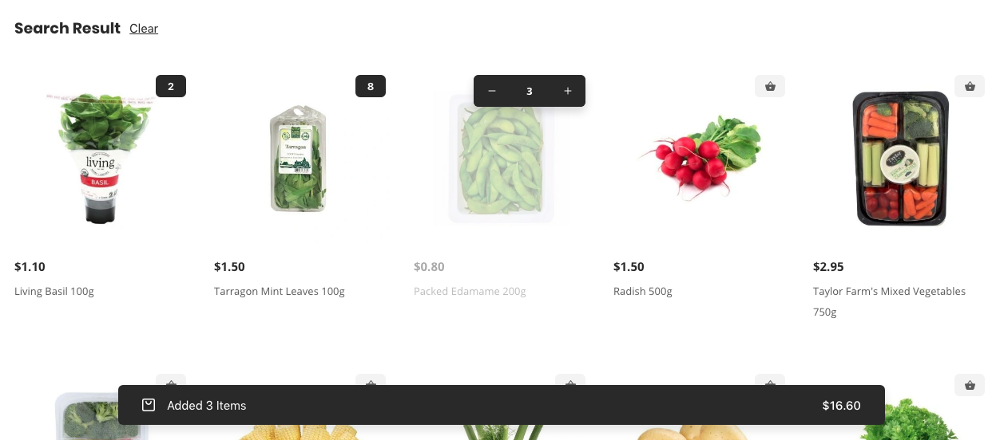

# Quick Cart

Quick cart is one of the main feature of our app. Redirecting use to the single product page or opening a modal for adding cart is pretty much traditional way. we wanted to implement a quick carting system so that customer can easily add product to their cart and easily to the checkout without redirecting to the other page.



Cart view,


For implementing cart we have used react context provider, you will find the implementation in the below file,

```
provider/cart-provider.tsx
provider/local-cart-provider.tsx
```
