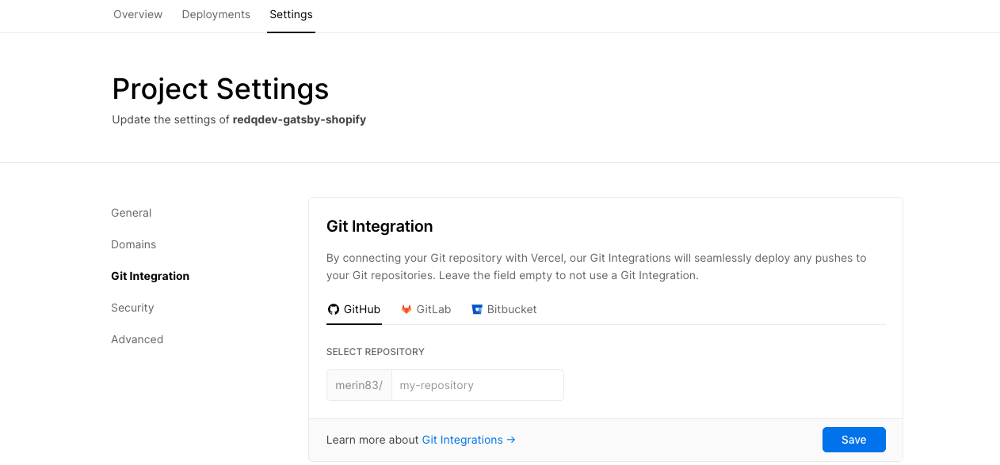
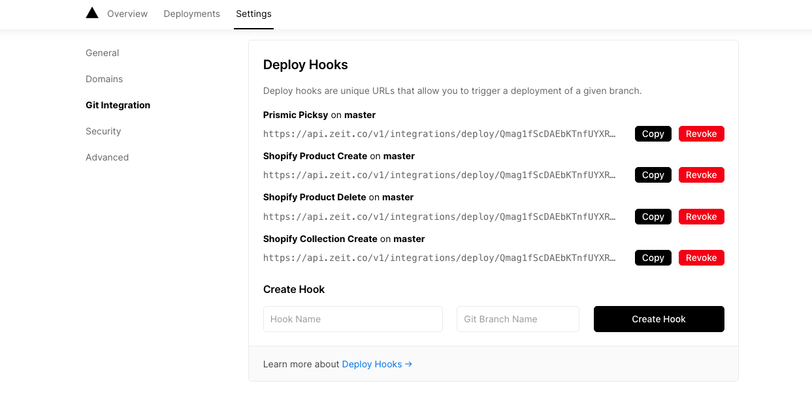
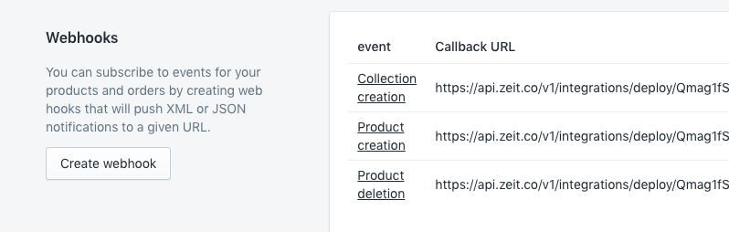
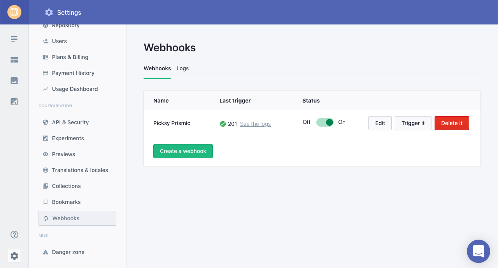

# Automatic Build

Till now we have successfully setup Shopify, Prismic, Gatsby \(Picksy\). Run the app on development and production. Deployed the app on Now \(Vercel\).

we already know that Gatsby is a SSG \(Static Site Generation\) means it generates your site with your API changes only when you build it. If there is any change comes in the api e.g. you added a new product or updated the name of a product. you need to rebuild gatsby in order to have those changes.

In short, Automatic Build solve this problem. So, whenever we make changes in our shopify product or Prismic CMS content we will want to have this changes in our live site without having to manually build and deploy the site each time there is a change. That's where Automatic Build with Webhooks comes into play.

#### How automatic build works

1. Put your code in a github repository
2. Integrate your github repository with Now\(Vercel\) account.
3. Generate Deploy Hooks from your Now app.
4. Add Deploy hooks to your shopify webhook section.
5. Add Deploy hooks to your prismic webhook section.
6. After that shopify product or prismic content change will trigger automatic build & deploy.
7. In a few minutes your changes will appear in your live site.

1.**Put your code in a github repository:**

Put your code in a github repository. Not going to go into details for this section.

**2.Integrate your github repository with Now\(Vercel\) account**

Go to your **Now account** -&gt; **Project Settings -&gt; Git Integration **and follow the below image to add your github repo into Now.

---

** 3.Generate Deploy Hooks fron your Now app**

Go to your **Now account** -&gt; **Project Settings **-&gt; **Git Integration** -&gt; **Deploy Hooks** Generate Deploy Hooks from the Deploy Hook section

..

**4.Add Deploy hooks to your shopify webhook section**

Copy Deploy hook from Now and Move to Shopify Settings -&gt; Notifications -&gt;Webhooks -&gt; Create webhook. For the event, choose **Product creation**, leave the format as JSON and paste the URL from the Deploy hook and hit Save webhook. Do this again two more times for **Product deletion **and **Product update** and any other event you feel may be necessary.

**5 Add Deploy hooks to your prismic weebhook section**

Same way create deploy hook in Now and Add them in your Prismic Webhook section from **Settings -&gt; Webhooks -&gt; Create a webhook**

