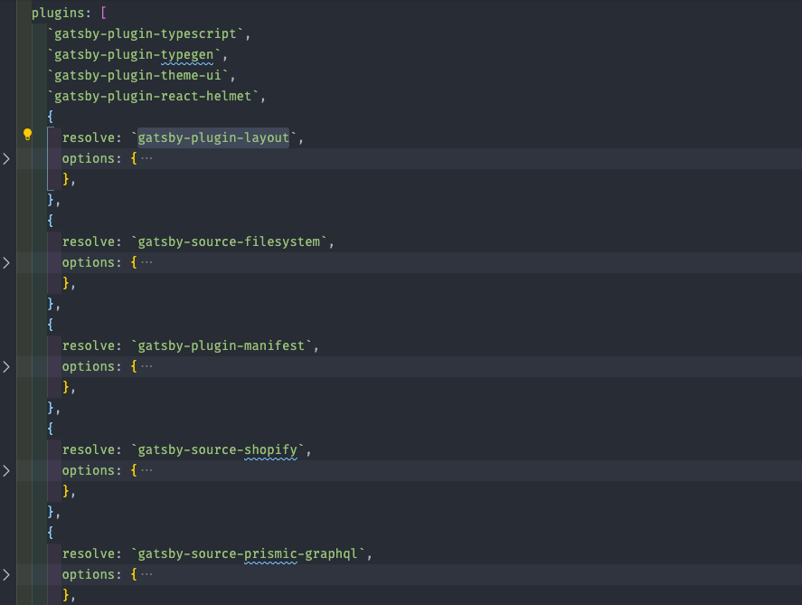

# gatsby-config.js

If you are familiar with gatsby development you should already know what does file does. If you don't know about it yet don't worry, you can easily learn about it from there [official docs](https://www.gatsbyjs.org/docs/gatsby-config/)

we have used several source plugin such as,

1. **gatsby-source-shopify: **For sourcing shopify product, collection into gatsby.

2. **gatsby-source-prismic-graphql: **For sourcing Prsmic content into gatsby.

3. **gatsby-plugin-layout: **For defining global component such as context provider, layout in one place.

our gatsby-config.js file looks similar to the below image,

