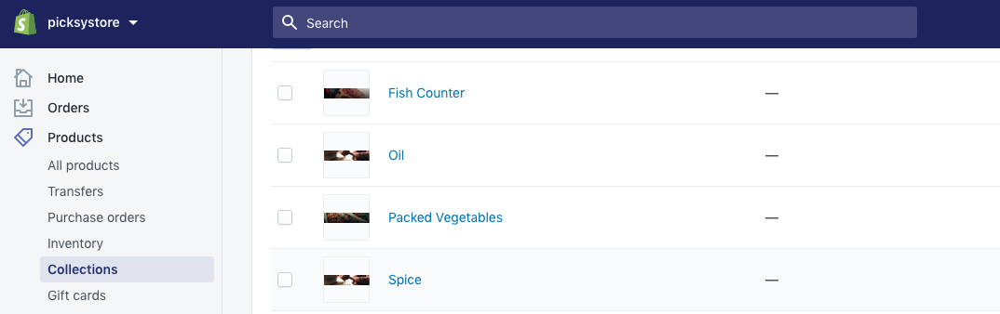
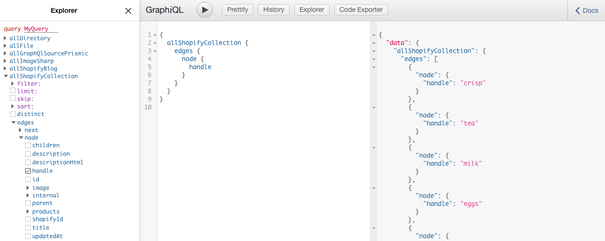
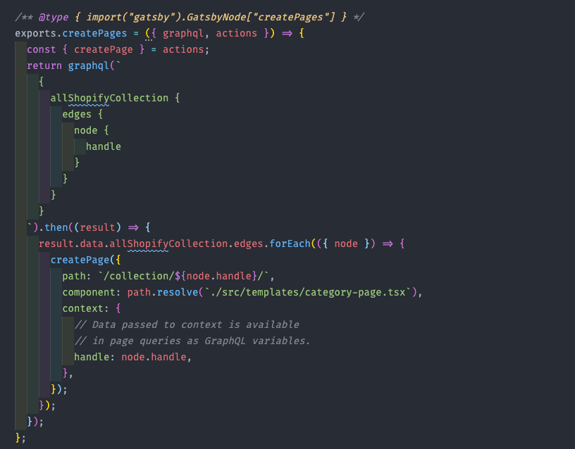

# **gatsby-node.js**

In the gatsby-node.js file we have basically fetched all our shopify collection and generated dynamic page based on shopify collection.

Here's how our shopify collection look like in our shopify store,

When we source our shopify collection in graphql, image taken from [http://localhost:8000/](http://localhost:8000/__gra)[\_\_\_graphql](http://localhost:8000/___graphql)

and finally we generated the dynamic category pages in the gatsby-node.js file.

NB: don't worry about those underlines those are catching spelling mistakes in my editor.
