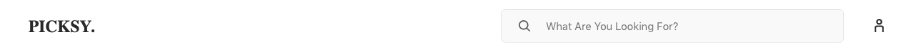

# 2.Header with Logo, Search, Account Link

Header section contain Logo, Search & Account Link. This are mostly static section comes from the code. As we thought Logo, Search, Link won't change regular basis. Buy you are welcome to add these content from prismic if you want.

you can find the implementation of this section, change the logo in the below file,

```
components/header/topbar/topbar.tsx
```

Search implementation discussed in our dedicated search section.
