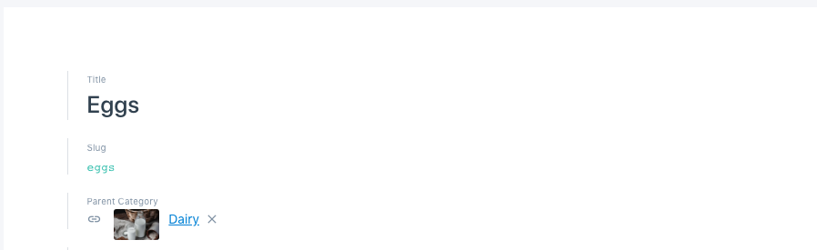

# 3. Menu Section

In the gatsby-node.js file we showed how you can generate dynamic category pages. well still you need to access those pages from some where. That's why we have created this menu section. Menu section is one of the core feature for this app. Because your customer can easily access those category pages.

Which means your customer can **quickly check which products are available** in those category pages. This comes very handle for a grocery site where customer try the category menu before using the search.

All thought the **category or collection** is created on the shopify store but **we have recreated each collection from shopify to our Prismic CMS** . Because we wanted more control over our category. Now we can easily show and remove category from prismic without having to delete it from our shopify store.

Lets see how we have implemented it,

1.We have created a **repetitive category** type in prismic


2.Copy the category.json file contents from the** prismic-custom-type** folder \(check in the downloaded folder\)


3.Paste it in the JSON editor as shown in the below image on the right side. it should generate the left side field before or after you save it.


4.Now check the below image how we have enter our category content from shopify to prismic


you can see there are three fields **Title, Slug, Parent Category**

i\) Your shopify collection Title

ii\) Your shopify collection unique slug

**iii\) Parent Category?** well we don't have parent category in shopify we just created it in prismic. so that we can show our shopify collection under specefic menu just like the below image,


In the Above image Vegetables, Organic, Snacks & Beverages, Fish & Meat, Dairy, Bakery & Pastry are parent categories. we didn't created these category or collection under shopify because shopify by default don't support nested collection. So we just created them in Prismic. Parent Category don't have any slug because they don't have any category pages what is important here you provide the Title and enable the parent category for the child category like below image where Dairy is a parent category of Eggs,



**N.B. Please note that if you don't choose parent category it won't show up in the dorpdown menu**

for query and code implementation check the below file,

```
components/header/navbar/main-menu.tsx
```
