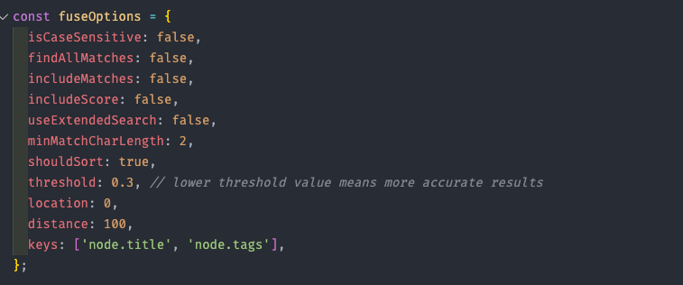
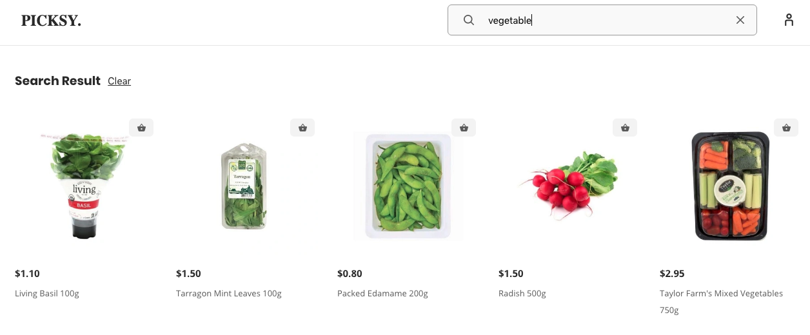

# Search

Search section is quite straight forward, we queried all of our shopify products and use fuse.js to implament the fuzzy search in the product title and tag.

fuzzy search configuration,



You can check how search works with tags in the below image,



you can check the implementation in the below file,

```
components/search/index.tsx
```
