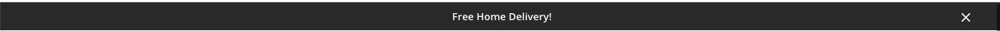
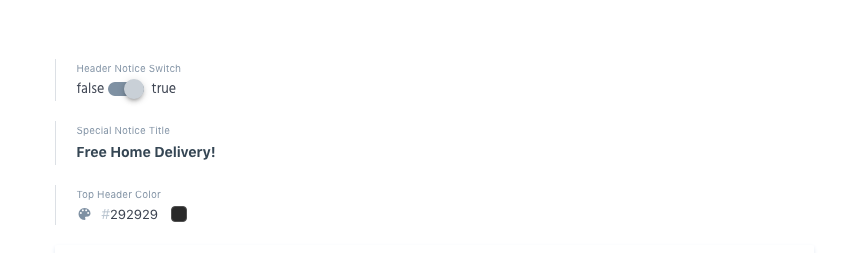
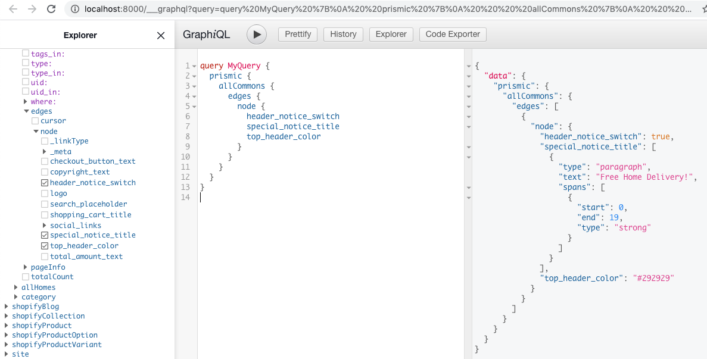
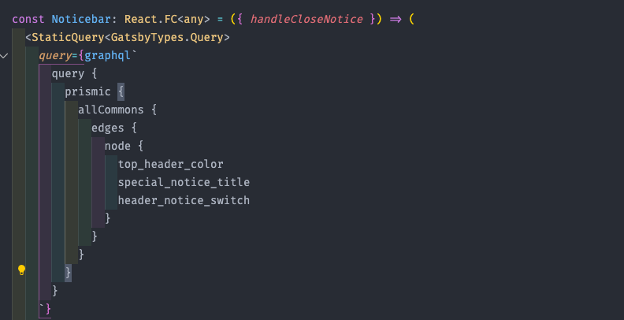

# **1.Notice Bar**



We have added a small notice section. The content comes from the prismic. You can show and hide this notice from your prismic content.
You can find the above settings in the common content in your prismic data. To check this noticebar implementation head over to the below file,

```
components/header/noticebar/noticebar.tsx
```

First we have tested the prismic data in our graphql playground



then we have implemented that query in our Noticebar component to retrieve the notice section data from prismic,


