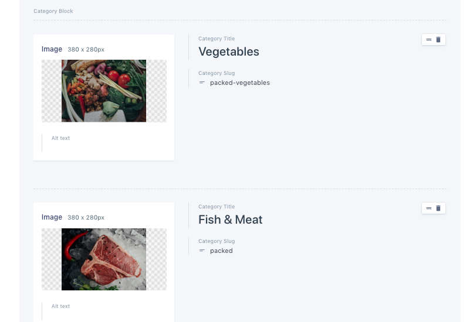

# Prismic Static Content

This section will cover below points from Home Page,

1. Banner Section

2. Category Block

3. How it works

4. Shipping Banner section

5. Footer

As this section comes from prismic so we will assume that you have created all the prismic type suggested in **Setup Prismic** section.

you will find the query and implementation in the below file,

```
pages/index.tsx
```

we will show here how we have created the content in prismic,

### 1.Banner Section

We just uploaded the banner image in prismic Home Page


you will also find banner title, subtitle and button text there


### 2. Category Block

Category block comes from the prismic, it's a prismic group field with image, title and slug.


Prismic Structure


Prismic Content



### 3.How It Works

Here's how we have created the structure of how it works in prismic,


We took two rich text field for Title and Subtitle and a group field with image, title and description which enable the option to add similar content.


and how it looks in our app,


In the Same way we have created the Shipping And Footer section
