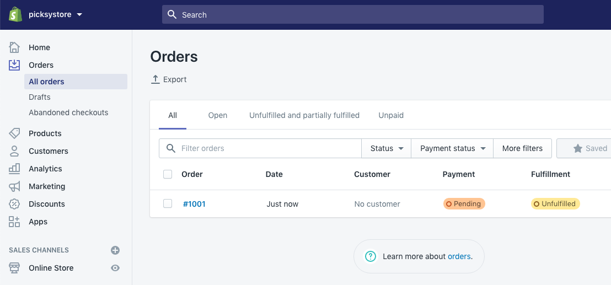

# Order

Once you will have some order you can see them in your shopify order section, you can also use shopify shop app for order notification in your mobile. you will get order notification in the email as well.

This is your shopify store. you are owner of your store. you can do any kind of changes here as you want. You can add any payment gateway as well.
